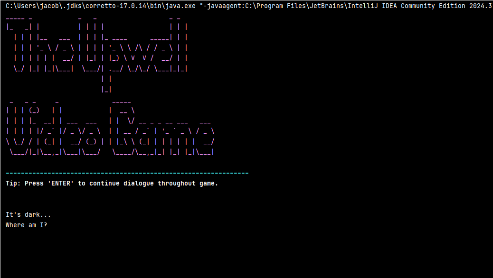
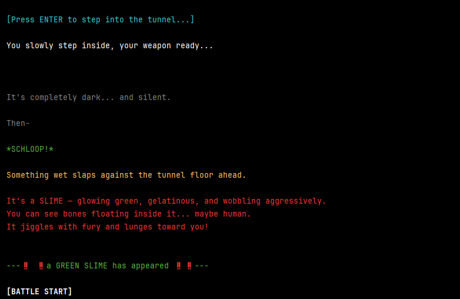
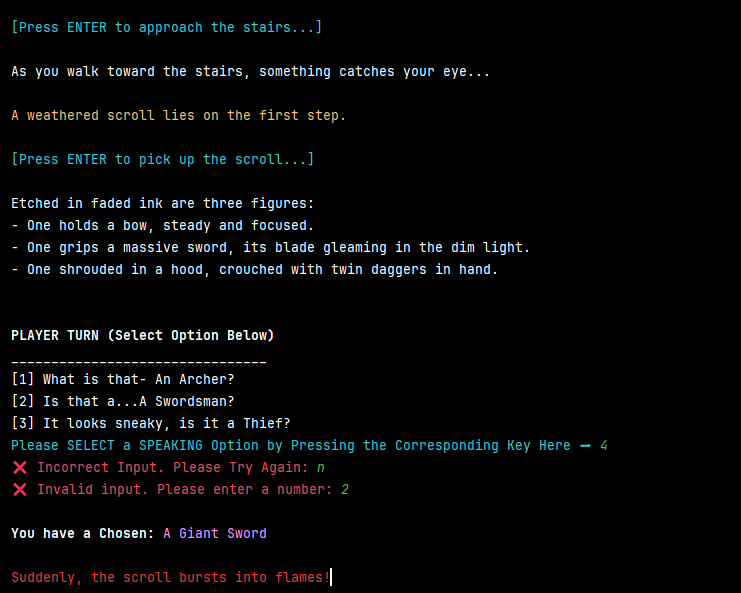
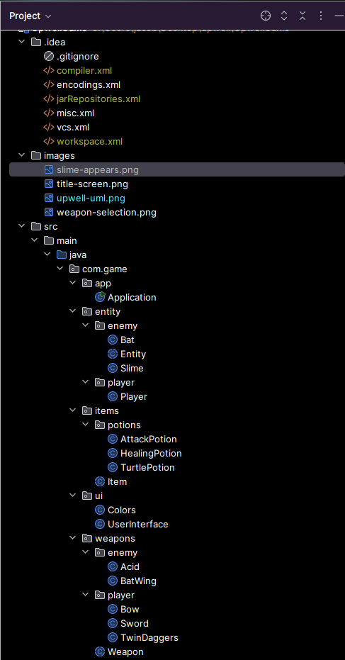
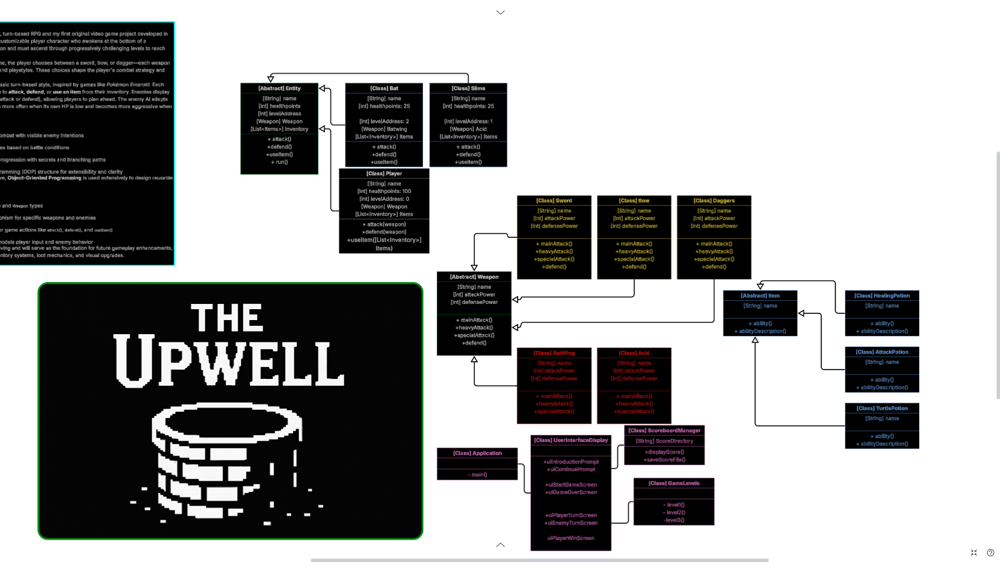

# 🕹️ The Upwell

**The Upwell** is a text-based, turn-based RPG built in Java.

You awaken at the bottom of a massive well, soaked in cold water with **no memory of how you got there**. The only way forward is **up**.

Armed with a weapon of your choosing, you begin climbing toward a faint light above—encountering strange creatures, making decisions, battling monsters, and uncovering the secrets hidden within the depths of the dungeon.

What began as a small Java project has evolved into a long-term development project focused on strengthening my skills in **Object-Oriented Programming, software architecture, game systems, and Java development**.

---

## 🎮 Features

| Story & Exploration                | Combat                                          | Technical                                           |
| ---------------------------------- | ----------------------------------------------- | --------------------------------------------------- |
| 🌑 Cinematic introduction          | ⚔️ Turn-based combat framework                  | 🎨 ANSI-colored terminal UI                         |
| 🧱 Interactive dungeon exploration | 🗡️ Weapon selection (Sword, Bow, Twin Daggers) | 🧠 OOP architecture using inheritance & abstraction |
| 📖 Narrative-driven progression    | 👾 Green Slime encounter implemented            | 🧩 Abstract Weapon hierarchy                        |
| Expandable story content           | 🎯 Weapon-specific attacks in development       | 🔄 Modular and reusable systems                     |

---

## 📸 Screenshots

### Title Screen



### First Enemy Encounter



### Weapon Selection



### Project Structure



### UML Class Diagram



---

## 🚧 Development Status (June 2026)

Development resumed after a lengthy pause and is actively progressing.

| ✅ Completed                   | 🔨 In Development           | 🎯 Next Milestones             |
| ----------------------------- | --------------------------- | ------------------------------ |
| Game startup & UI framework   | Weapon attack functionality | Complete first playable battle |
| Story introduction            | Damage calculation system   | Green Slime combat AI          |
| Dialogue progression          | Battle loop logic           | Victory & defeat conditions    |
| Player input validation       | Enemy AI behavior           | Expanded dungeon progression   |
| Weapon selection & assignment | HP bar system               | Additional enemy types         |
| Enemy encounters              | Combat balancing            |                                |
| Combat menu & HUD             |                             |                                |
| Abstract weapon hierarchy     |                             |                                |

**Current Focus:** Building the first complete combat encounter from start to finish.

---

## 🛠️ Installation

### Clone the Repository

```bash
git clone https://github.com/YOUR_USERNAME/upwell-game.git
```

### Run the Project

1. Open IntelliJ IDEA
2. Open the project folder
3. Run the main Java class

---

## 🎯 Learning Objectives

The Upwell serves as a long-term environment for practicing:

* Object-Oriented Programming (OOP)
* Inheritance & Polymorphism
* Abstraction & Encapsulation
* Software Architecture
* Game State Management
* Combat System Design
* AI Behavior Design
* Clean Code Principles
* Git & GitHub Version Control

---

## 🚀 Future Plans

### Combat

* Advanced enemy AI
* Status effects
* Critical hits
* Boss encounters
* Unique weapon abilities

### Exploration

* Additional dungeon levels
* Story branches
* NPC interactions
* Hidden events

### Systems

* Inventory management
* Equipment upgrades
* Save/load functionality
* Experience and leveling

### Technical Improvements

* Architecture refactoring
* Expanded testing
* Improved modularity
* Additional design patterns
* Enhanced terminal UI

---

## 🔄 Continuous Development

The Upwell is intentionally designed as a project that can continue evolving indefinitely.

Even after reaching a playable state, development will continue as new skills and ideas are acquired. New enemies, bosses, weapons, dialogue, systems, and architectural improvements will be added over time.

**The Upwell is never truly finished—it grows alongside my development as a software engineer.**

---

## 💡 Inspiration

* Undertale
* Pokémon (turn-based combat)
* Classic text adventure games
* Dungeon crawler RPGs
* Terminal-based roguelikes

---

## 📌 Author

**Jacob Nealy**

Software Engineer • Java • Object-Oriented Design • Game Systems
